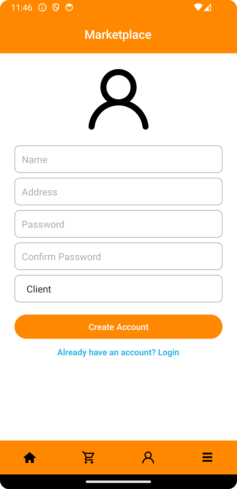

# Android Marketplace App

## Overview

The Android Marketplace App is a versatile platform that allows users to explore a variety of products. It caters to both simple users and registered users (clients and providers). For providers, additional features include the ability to add a store, categories, and products. The app facilitates user registration and provides a seamless experience for browsing and shopping.

## Features

1. **Product Browsing:**
   - Browse through a diverse list of available products.
   - Seamlessly navigate between categories.

2. **User Registration:**
   - Create an account for an enhanced shopping experience.
   - Differentiate between simple users, clients, and providers.

3. **Provider Features:**
   - Registered providers can add stores to showcase their products.
   - Add categories to organize products effectively.
   - Easily add new products to the marketplace.

## Screenshots

<table>
    <tr>
      <td align="center">
        
         <b>Home Page</b>
      </td>
      <td align="center">
        
         <b>All Categories Page</b>
      </td>
      <td align="center">
        
         <b>Login Page</b>
      </td>
      <td align="center">
        
         <b>Registration Page</b>
      </td>
    </tr>
    <tr>
        <td align="center">
          
           <b>Empty Shopping Cart</b>
        </td>
        <td align="center">
          
           <b>Item Added to Cart</b>
        </td>
        <td align="center">
          
           <b>Items in Shopping Cart</b>
        </td>
      </tr>
    <tr>
      <!-- Add more columns with screenshots and descriptions as needed -->
    </tr>
  </table>

*Note: These screenshots showcase the primary features, and there are additional features available for registered users, such as adding stores, categories, and products.*

## Technologies Used

- **Android Studio:** The primary IDE for Android app development.
- **Java:** The programming language used for app logic.
- **Retrofit:** A library for making API calls and handling responses.
- **RecyclerView:** Efficiently display lists of products.

## Backend

The Android Marketplace App is powered by the [Marketplace Spring Boot Rest API](https://github.com/Da-achraf/marketplace-rest-api). This backend provides the necessary RESTful services to support various features of the app, including user authentication, product retrieval, and more.

### Technologies Used in the Backend

- **Spring Boot:** The backend framework used to develop the REST API.
- **Java:** The programming language used for backend logic.
- **Spring Data JPA:** Simplifies data access using the Java Persistence API (JPA).
- **Spring Security:** Handles authentication and authorization for secure endpoints.
- **MySQL:** The relational database management system used to store data.

For more details, please refer to the [Marketplace Spring Boot Rest API repository](https://github.com/Da-achraf/marketplace-rest-api).

